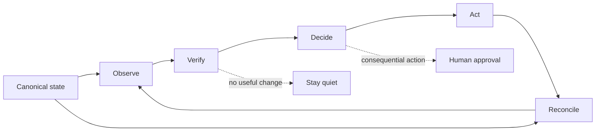

<p align="center">
  <a href="https://ai.patonpoints.com/projects/baymax/">
    
  </a>
</p>

<h1 align="center">Baymax Agent</h1>

<p align="center"><strong>An open-source personal agent that notices what changed, prepares what matters, and follows through.</strong></p>

<p align="center">
  <a href="https://ai.patonpoints.com/projects/baymax/">Product story</a> ·
  <a href="#quick-start">Quick start</a> ·
  <a href="docs/architecture.md">Architecture</a> ·
  <a href="#privacy-boundary">Privacy boundary</a>
</p>

Baymax is a local-first personal agent and household chief of staff built on
[Hermes Agent](https://github.com/NousResearch/hermes-agent). It lives in the
messaging channels you already use, checks approved sources in the background,
and turns changing context into a small number of useful decisions and actions.

It is designed as a chief of staff, not another chatbot: proactive without
being noisy, personal without leaking context, and capable of acting without
silently crossing an approval boundary.

> **Less to remember. Less to chase. More handled.**

This repository is the sanitized, open-source product layer behind the
[Baymax case study](https://ai.patonpoints.com/projects/baymax/). It includes
working dependency-free runtime primitives, synthetic examples, persona and
skill contracts, and disabled-by-default scheduled workflows. Private accounts,
records, credentials, destinations, and action adapters are deliberately not
published.

## What Baymax does

| Outcome | How the agent behaves |
| --- | --- |
| **Your morning, already sorted** | Combines inbox and calendar changes into one brief: what changed, what is handled, and the one decision worth making. |
| **It sees around corners** | Scans a bounded planning horizon, proposes at most a few useful next steps, and waits for an add or skip. |
| **Health context, carefully bounded** | Preserves freshness and missing data, labels correlations as observations, and never turns them into diagnoses. |
| **Context that closes the loop** | Keeps canonical commitments separate from conversational memory, prepares the next step, and reconciles approved outcomes once. |
| **Quiet when nothing needs you** | Skips empty updates, repeated reminders, and model calls when deterministic checks find no useful signal. |

Representative output stays brief and action-shaped:

```text
DAILY BRIEF · 09:45

Your day is clear until 2:00.
One conflict needs a decision; the options are ready.
Twelve low-priority messages were filtered out.

Review the conflict →
```

## The agent loop



1. **Observe** changes across explicitly registered sources.
2. **Verify** freshness, ownership, cancellations, duplicates, and source health with code.
3. **Decide** with a model only when bounded context needs judgment.
4. **Act** through an allowlisted private adapter, with approval where consequences matter.
5. **Reconcile** the confirmed result back into canonical state.

Hermes provides the conversation loop, model and tool orchestration, gateway,
memory, and provider flexibility. Baymax adds the operating model that makes
those capabilities dependable over time.

| Hermes provides | Baymax adds |
| --- | --- |
| Agent loop and tool use | Proactive scheduled workflows and quiet/no-op behavior |
| Messaging gateways | Audience-aware private/shared routing |
| Models and providers | Deterministic and judgment execution lanes |
| Conversation memory | Curated recall plus canonical state boundaries |
| Ability to take actions | Approval gates, allowlists, verification, and reconciliation |
| Extensible skills | Product skills for briefings, planning, health evidence, inboxes, devices, and recovery |

## What is included

- `runtime/` — dependency-free context filtering, routing, approval,
  reconciliation, safe outcome summaries, and bounded background fan-out.
- `cron/jobs.json` — 20 sanitized workflow contracts, all disabled by default
  and limited to local or synthetic destinations.
- `prompts/cron/` — inspectable prompt contracts for every scheduled workflow.
- `skills/` — reusable boundaries for chief-of-staff behavior, staged triage,
  audience routing, curated memory, health evidence, deterministic devices,
  guarded inbox automation, backup/restore, and external actions.
- `SOUL.md` and `.hermes.md` — a deployment-neutral identity and operating
  contract for a calm, precise personal agent.
- `examples/` — synthetic configuration, source, surface, and runtime inputs.
- `scripts/` and `tests/` — safe local demos, contract validation, and
  standard-library tests.

The September 2026 refresh incorporates the most reusable lessons from the
live deployment since this repository first launched:

- messaging is audience-aware and adapter-neutral rather than tied to one chat platform;
- curated project recall is separate from canonical commitments and generated views;
- inbox automation uses deterministic rules first and bounded classification only for ambiguity;
- device automation records evidence before acting, guards known baselines, and fails closed;
- backups are encrypted and paired with recurring restore preflight checks; and
- retired experiments stay retired instead of being revived by generic health repair.

## Quick start

### 1. Install Hermes Agent

```bash
curl -fsSL https://hermes-agent.nousresearch.com/install.sh | bash
source ~/.zshrc  # or source ~/.bashrc
hermes doctor
hermes setup
```

See the [upstream documentation](https://github.com/NousResearch/hermes-agent#quick-install)
for platform and provider-specific setup.

### 2. Clone Baymax Agent

```bash
git clone https://github.com/patppham/baymax-agent.git "$HOME/.baymax-agent"
cd "$HOME/.baymax-agent"
python3 -m unittest discover -s tests -v
python3 scripts/validate_public_surface.py
```

### 3. Run the synthetic loop

```bash
python3 -m runtime \
  --input examples/runtime-input.json \
  --now 2026-07-16T12:00:00Z
```

The demo observes and verifies synthetic records, prepares a bounded proposal,
waits for approval, and reconciles synthetic completion state without sending
anything. Add `--approved` to exercise the non-production authorization path;
the public package still never executes an external action.

### 4. Build your private overlay

Keep the upstream checkout, this public blueprint, and your private deployment
as separately versioned repositories. Copy only the contracts you intend to
use, then implement private source, state, delivery, and action adapters behind
them.

```bash
PRIVATE_RUNTIME="$HOME/.baymax-private"
mkdir -p "$PRIVATE_RUNTIME"
cp -R SOUL.md .hermes.md cron prompts skills "$PRIVATE_RUNTIME"/
```

Replace placeholders only in the private overlay. Authenticate your own model,
messaging, email, calendar, health, device, browser, and storage integrations
with the minimum scopes they require. Never commit those credentials or the
records they unlock.

Start with [`docs/runtime-mirror.md`](docs/runtime-mirror.md) for the replication
sequence and [`examples/runtime-surface.json`](examples/runtime-surface.json)
for the audited private-to-public responsibility map.

## Privacy boundary

This repository contains generic code, documentation, contracts, and synthetic
fixtures. It does **not** contain:

- credentials, tokens, OAuth state, cookies, databases, logs, or sessions;
- real messages, calendar identifiers, health, financial, insurance, or household records;
- names, addresses, phone numbers, production destinations, device identifiers, or local paths;
- private prompts, source-specific corpora, or authenticated action scripts; or
- a copy of the live runtime or upstream Hermes checkout.

Every external effect belongs behind a private adapter with an explicit target,
policy, and approval boundary. Run `python3 scripts/validate_public_surface.py`
before publishing any derived repository.

## Design principles

- Code where facts must be exact; models where judgment adds value.
- Canonical state is separate from memory and generated views.
- Missing evidence stays missing.
- Private context does not enter shared output by accident.
- Consequential actions stop for approval.
- Silence is a valid and often preferred outcome.

## Project status

Baymax Agent is an independent companion to Hermes Agent, not an official Nous
Research distribution and not a turnkey hosted service. The code here is a safe
reference implementation; the live product depends on private integrations and
household policy that each operator must supply for themselves.

Contributions must remain generic and synthetic. See [`CONTRIBUTING.md`](CONTRIBUTING.md)
and [`SECURITY.md`](SECURITY.md).

Released under the [MIT License](LICENSE).
